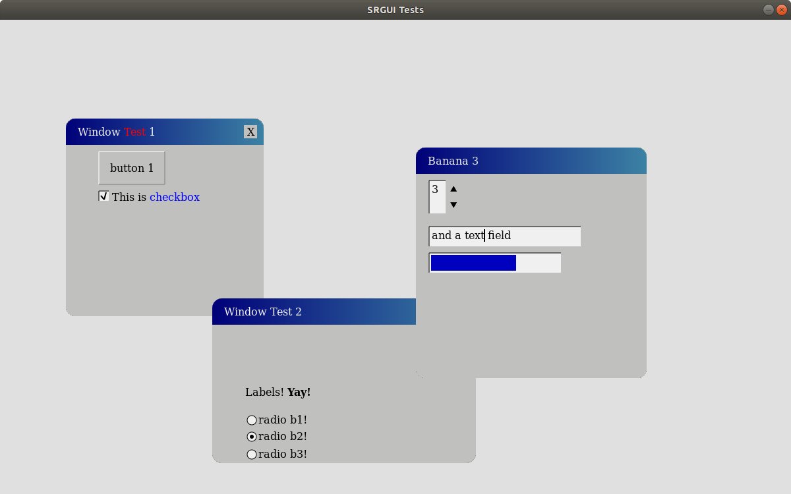

# SRGUI
## Intro

SRGUI (pronounced Sir Gooey) stands for Simple Retained-mode Graphical User Interface (as in the title). Is a simple C++ GUI toolkit for creating overlay windows for simple utilities or debug interfaces. If a wider selection of fancier widgets is desired, use [Dear ImGui](https://github.com/ocornut/imgui) (it's super intuitive and works great) instead. SRGUI differs from ImGui in being retained mode and offering less attractive and fewer widgets. In fact, the author of SRGUI is a big fan of the late 20th century Windows look (win98/2000) and uses that as the inspiration for the look and feel of SRGUI (it is not duplicated exactly). SRGUI supports a certain amount of style/"look and feel" configuration. Any assistance is appreciated. New controls should (please) do their best to interpret the style settings.

Demo Screenshot:

## Usage

SRGUI works like any conventional GUI toolkit (eg Gtk+, Qt, win32, etc). The only difference is how the graphics get to the screen. SRGUI either renders everything to a single image buffer (with configurable background color, including transparent) or delivers a display list of the individual windows to be drawn by the client (eg as OpenGL textures on rectangles). The display list also indicates when a surface has changed (eg needs re-uploading to vram).

## Backends / Dependencies

The majority (currently all) of the rendering in SRGUI is done with Cairo. This may change when SRGUI is further along and the needed graphical operations are well established. Text rendering uses Pango, but other options (going latin-alphabet-only and using stb_truetype) have not been ruled out.
The current demo uses SDL2 to get SRGUI to the screen.

## Events / Thread Safety

SRGUI needs to be notified of events so that the UI can react to the keyboard and mouse. This is done with the SendEvent function. It takes the event and up to 4 pieces of related data (if an event uses less, they are ignored but zeros should be passed). SRGUI uses global variables rather than require the user pass around a context. SRGUI is not thread safe. It is expected that typical usage will be a single instance of SRGUI that is only ever operated upon by one thread. 

## Building the demo

g++ -std=c++17 *.cpp \`pkg-config --cflags --libs sdl2 cairo pangocairo\`

